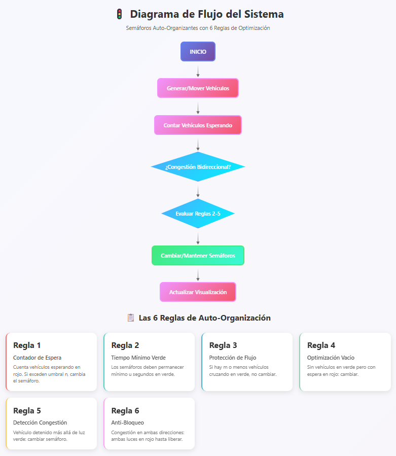
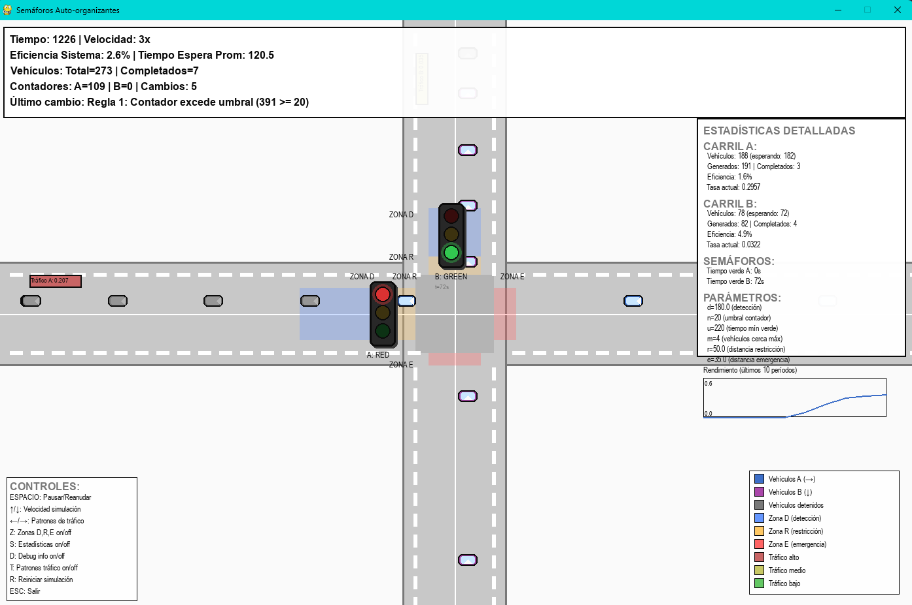

# Simulación de Semáforos Auto-organizantes

Una simulación avanzada de un cruce de tráfico controlado por semáforos inteligentes que se auto-organizan basándose en el flujo real de vehículos, implementando 6 reglas fundamentales de control de tráfico.

## 🚀 Cómo Ejecutar la Simulación

### Requisitos
- Python 3.8+
- Pygame

### Instalación
```bash
pip install pygame
```

### Ejecución
```bash
python run_sim.py
```

## 📋 Diagrama de flujo




## 🎯 Parámetros del Sistema

| Parámetro | Valor | Descripción |
|-----------|-------|-------------|
| `d` | 200.0 | Distancia de detección de vehículos aproximándose |
| `n` | 25 | Umbral del contador para cambio de semáforo |
| `u` | 12 | Tiempo mínimo obligatorio en verde |
| `m` | 5 | Máximo número de vehículos cerca para no cambiar |
| `r` | 60.0 | Distancia de restricción para cambios |
| `e` | 40.0 | Distancia de detección de bloqueos |

## 🚗 Características del Tráfico

### **Sistema de Spawn Dinámico**
- **Patrones independientes por carril** con ciclos variables (250-380 unidades)
- **15% probabilidad de períodos sin tráfico** (tasa = 0)
- **5% probabilidad de picos súbitos** de tráfico intenso
- **Variación extrema**: 0.3x a 2.5x la tasa base
- **Tasas base aleatorias** por carril al iniciar

## 🎮 Controles

| Tecla | Función |
|-------|---------|
| `ESPACIO` | Pausar/Reanudar simulación |
| `↑/↓` | Ajustar velocidad de simulación (1x-10x) |
| `←/→` | Ajustar intensidad de picos de tráfico |
| `Z` | Mostrar/ocultar zonas D, R, E |
| `S` | Panel de estadísticas detalladas |
| `D` | Panel de debug con métricas de separación |
| `T` | Indicadores de patrones de tráfico |
| `R` | Reiniciar simulación |
| `ESC` | Salir |

## 📊 Visualización

### **Elementos Gráficos**
- **Vehículos azules**: Carril A (movimiento horizontal →)
- **Vehículos magenta**: Carril B (movimiento vertical ↓)  
- **Vehículos grises**: Detenidos
- **Zona D (azul)**: Área de detección de vehículos
- **Zona R (naranja)**: Área de restricción para cambios
- **Zona E (roja)**: Área de detección de bloqueos

### **Indicadores de Tráfico**
- **Verde**: Tráfico bajo
- **Amarillo**: Tráfico moderado
- **Rojo**: Tráfico alto/picos


## 🔍 Verificación del Funcionamiento



## Integrantes del grupo

- Laura González
- Camilo Madero    
- Paula Páez

